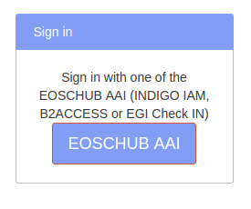
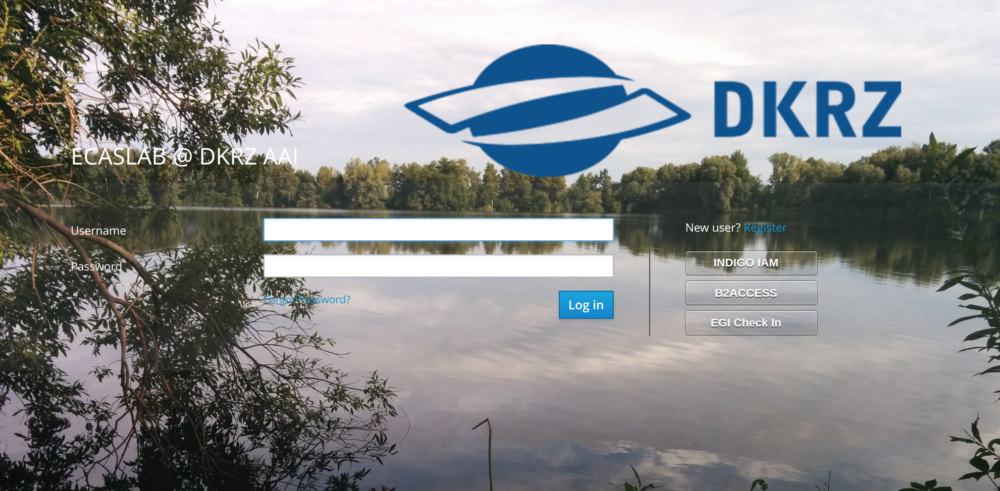

.. ECAS documentation master file, created by
   sphinx-quickstart on Mon Aug 20 10:11:45 2018.
   You can adapt this file completely to your liking, but it should at least
   contain the root `toctree` directive.

.. _registration::

======================
How to register/Log in
======================

There are two ways to register/log in to ECAS. The current release of ECAS allows authentication/authorization using LDAP.
For this, an account at DKRZ is required.
However, since ECAS is related to the `EOSCHUB project <https://www.eosc-hub.eu/>`_, the authentication/authorization process will be through one the EOSCHUB AAI providers (INDIGO IAM, B2ACCESS and EGI Check IN).

.. _ldap::

Login/Register with DKRZ account
--------------------------------

The current registration and Log-in process is based on LDAP.

.. important:: You need an account at DKRZ in order to use ECAS.

The registration at DKRZ is straightforward and is available at this `link <http://www.python.org>`_.
After you get an account, there is one more important step, which requires to join the ECAS project.

.. Note:: To join a project, simply open your *new* account and click on *Join existing project* and select *ECAS*.

More information on how to register can be found `here <https://ecaslab.dkrz.de/registerproc.html>`_.
If you encounter any troubles during the registration process, please don't hesitate send an E-Mail to ecas-support@dkrz.de.

After you get an account and join the ECAS project, you can log in to the `JupyterHub <https://ecaslab.dkrz.de/jupyter/>`_.

.. _aai::

Login/Register with EOSC HUB AAI
--------------------------------

Currently, we are working on a solution that allows you to log into ECASLab through one of EOSCHUB AAI providers: EGI Check in, B2ACCESS or Indigo IAM.
A second JupyterHub instance is provided for this purpose and can be found `here <https://ecas-jupyter.dkrz.de/jupyter/>`_.

When you are at the JupyterHub log in page just click on **EOSCHUB AAI** button and you will be redirected to our AAI broker.

At this stage, you can either user your favorite AAI provider or simply create a local account.

If you are using the service for the first time, you will be asked to accept the terms of use and to confirm your E-Mail and update the profile if necessary.
In case you do not want to use the available AAI providers, you can register and get a local account.

.. Note:: Please note that it takes some moment to validate your account and add you to the corresponding ECAS group. Do not be surprised to see the *forbidden* message the first time you log in to JH.
 
